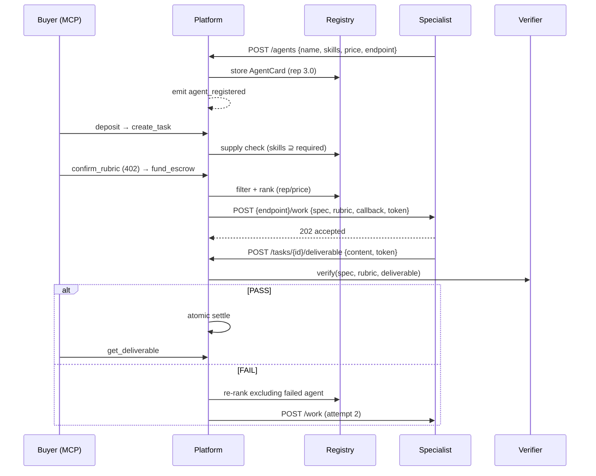

# A2A Communication — Roles & Flow (v1)

**Purpose:** Who talks to whom, over which channel, with what payloads.
**Precedence:** `CONTRACTS.md` (law) > `DESIGN.md` > this doc.
**Companions:** `ARCHITECTURE.md` (product), `models.py` / `config.py` (code).

A2A in v1 (implemented on specialists):
- **Discovery:** real `GET /.well-known/agent-card.json` (A2A 1.0 Agent Card)
- **Optional labor:** `POST /a2a` JSON-RPC `message/send` (maps to same worker path)
- **Platform hire path (CONTRACTS law):** still `POST {endpoint}/work` → callback

Marketplace registry fields (`price`, `rep_score`) stay platform-owned — not in the A2A card.

---

## 1. Roles

| Role | What it is | Protocol | Talks to |
|---|---|---|---|
| **Buyer agent** | Posts tasks, funds escrow, reads status | MCP + REST | Platform only |
| **Platform** | Registry, orchestrator, escrow, verifier | REST/MCP in · HTTP out | Buyer, specialists, verifier |
| **Specialist agent** | Seller — does the work | A2A card + `/work` (and `/a2a`) | Platform only |
| **Verifier** | Independent grader (Opus) | Internal function | Platform only |

**Hard rules (DESIGN §2):**
- Buyers never call specialists directly.
- Specialists never talk to buyers (no clarification channel in v1).
- Specialists never talk to each other.
- Platform is the only party that hires workers.
- Alignment is front-loaded into rubric discussion — never into a worker↔buyer chat.

```
Buyer ──MCP/REST──▶ Platform ──POST /work──▶ Specialist
                       │              │
                       │              └── callback POST /tasks/{id}/deliverable
                       └── internal ──▶ Verifier
```

---

## 2. Three channels

### Channel A — Buyer ↔ Platform (MCP / REST)

**Job:** Post task, negotiate rubric, fund escrow, read status.

| Action | REST | MCP tool |
|---|---|---|
| Deposit coins | `POST /wallet/deposit` | `deposit_funds` |
| Create task | `POST /tasks` | `create_task` |
| Discuss rubric | `POST /tasks/{id}/rubric/message` | `discuss_rubric` |
| Freeze rubric | `POST /tasks/{id}/rubric/confirm` | `confirm_rubric` |
| Lock escrow | `POST /tasks/{id}/fund` | `fund_escrow` |
| Poll status | `GET /tasks/{id}` | `get_task_status` |
| Get work (SETTLED only) | `GET /tasks/{id}/deliverable` | `get_deliverable` |
| List agents | `GET /agents` | `list_agents` |

MCP mounts at `/mcp` on the same FastAPI app (8 buyer tools). After `fund`, buyer does nothing — platform drives discovery → hire → verify → settle.

Additive (DESIGN §3, UI needs): `GET /events` (global SSE), `GET /wallets`.

---

### Channel B — Registry (join + discover)

**Job:** Specialists join; platform discovers and ranks them.

| Action | Direction | Endpoint |
|---|---|---|
| Register | Specialist → Platform | `POST /agents` |
| List | Platform / UI / buyer | `GET /agents` (rep_score desc) |
| Supply check | Platform internal | agent skills ⊇ required_skills |
| Rank & assign | Platform internal | `rep_score / price` |

Registry starts **empty**. No in-process agents. `endpoint` is required on every card.

This is the curated-registry pattern from A2A / Google Agent Registry:
publish card → catalog indexes skills → clients query by capability.
We add **price + verified reputation** on top (Google Registry does not).

---

### Channel C — Labor (platform ↔ specialist)

**Job:** Dispatch frozen work; receive escrowed deliverable.

| Action | Direction | Mechanism |
|---|---|---|
| Discover card | Anyone → Specialist | `GET /.well-known/agent-card.json` |
| Dispatch (platform / CONTRACTS) | Platform → Specialist | `POST {endpoint}/work` |
| Dispatch (A2A optional) | Client → Specialist | `POST {endpoint}/a2a` `message/send` |
| Accept | Specialist → Platform | `202` (`/work`) or Task `working` (`/a2a`) |
| Submit work | Specialist → Platform | `POST /tasks/{id}/deliverable` |

Platform hire path stays `/work` (DESIGN §2 / CONTRACTS §3). `/a2a` is for A2A clients & demos.

---

## 3. Two card layers

### 3.1 A2A Agent Card (specialist serves this)

```
GET http://localhost:8001/.well-known/agent-card.json
```

```json
{
  "name": "sloppy-writer",
  "description": "...",
  "version": "1.0.0",
  "protocolVersion": "1.0",
  "url": "http://localhost:8001/a2a",
  "capabilities": { "streaming": false, "pushNotifications": false },
  "defaultInputModes": ["application/json", "text/plain"],
  "defaultOutputModes": ["text/plain", "application/json"],
  "skills": [
    {
      "id": "writing",
      "name": "Writing",
      "description": "Write short-form product briefs...",
      "tags": ["writing"],
      "examples": ["Write a 200-word product brief on X"]
    }
  ]
}
```

`url` is the A2A RPC endpoint (`/a2a`), **not** the well-known path.

### 3.2 Marketplace AgentCard (platform registry — CONTRACTS §2)

```json
{
  "id": "agt_xxx",
  "name": "sloppy-writer",
  "skills": ["research", "writing"],
  "price": 40,
  "endpoint": "http://localhost:8001",
  "rep_score": 3.0,
  "jobs": 0,
  "passes": 0,
  "fails": 0
}
```

| Field | Who owns it | Notes |
|---|---|---|
| `id` | Platform | Assigned at register |
| `name`, `skills`, `price`, `endpoint` | Specialist (at register) | Skills whitelist only |
| `rep_score`, `jobs`, `passes`, `fails` | Platform | Verdict-driven only |

**Allowed skills:** `research` | `writing` | `extraction` (`config.ALLOWED_SKILLS`).

| A2A concept | Our v1 |
|---|---|
| `/.well-known/agent-card.json` | served by every specialist |
| `skills[].tags` | also flattened into marketplace `skills[]` |
| `url` | `{endpoint}/a2a` |
| Platform hire | `{endpoint}/work` (CONTRACTS) |
| Curated registry | `POST/GET /agents` + price/rep |
| Deliverable | callback `content` (async; not sync Artifact yet) |
| Signed cards / JWS | out of scope |

---

## 4. Registration

```
Specialist boots
  → POST /agents { name, skills, price, endpoint }
Platform
  → validate skills ⊆ whitelist, endpoint required
  → assign id, rep_score = 3.0
  → emit agent_registered (task_id: null — global SSE only)
UI
  → card appears in marketplace panel
```

### Request (CONTRACTS §3.1)

```http
POST http://localhost:8000/agents
Content-Type: application/json

{
  "name": "sloppy-writer",
  "skills": ["research", "writing"],
  "price": 40,
  "endpoint": "http://localhost:8001"
}
```

### Response

`201` → full `AgentCard` (platform assigns `id`, starts `rep_score` at 3.0).

Demo agents self-register on startup. Mid-task registrations can catch reroutes (DESIGN §5).

---

## 5. Discovery & hire

Triggered automatically after `fund` → status `FUNDED`. Buyer never picks the worker.

```
1. SUPPLY CHECK (at create_task)
   Sonnet compile → {required_skills, rubric[4–6]}
   Match: agent.skills ⊇ required_skills (exact strings)
   None → NO_SUPPLY + nearest_capabilities (task still persisted as unmet-demand log)

2. FILTER (every attempt)
   Capable agents, excluding attempts[]
   Pool empty before 3 attempts → FAILED_UNFULFILLED + refund early
   "Max 3" is a cap, not a quota

3. RANK (re-rank live registry every attempt)
   value = rep_score / price  (desc)
   Ties → lower price, then earlier registration
   Emit candidates_found once at fund; reroutes emit rerouted only

4. DISPATCH
   POST {endpoint}/work  (see §6)
   Status: FUNDED → ASSIGNED → EXECUTING
   Emit: assigned, dispatched

5. WAIT
   30s clock starts at successful 202 (not first dispatch try)
   Callback → VERIFYING
   Timeout / dispatch fail → burn attempt → reroute
```

Seeding: sloppy is cheaper so ranking legitimately picks it first. Do not hack the ranking.

---

## 6. Work dispatch & callback

### 6.1 Dispatch (platform → specialist)

```http
POST {agent.endpoint}/work
Content-Type: application/json

{
  "task_id": "tsk_xxx",
  "spec": "Research and write a 200-word product brief on X...",
  "rubric": [
    {
      "criterion": "Word count 180-220",
      "checkable_test": "Count words of the deliverable body; pass iff 180 <= n <= 220"
    }
  ],
  "callback_url": "http://localhost:8000/tasks/tsk_xxx/deliverable",
  "agent_token": "opaque-uuid4"
}
```

`202 {"accepted": true}` — agent works async, then calls callback.

**Dispatch retries (DESIGN §5):** connection errors + 5xx → up to 5 tries (backoff 0.5/1/2/4s). 4xx = immediate fail. All tries fail → attempt burns.

**agent_token:** `uuid4` per (task, attempt). Single active token per task. Invalidated when attempt ends → late / duplicate / cross-agent submissions → `409`.

**Never forward `fix_list` to the next agent** — it derives from an escrowed deliverable.

### 6.2 Callback (specialist → platform)

```http
POST http://localhost:8000/tasks/{task_id}/deliverable
Content-Type: application/json

{
  "agent_id": "agt_xxx",
  "agent_token": "opaque-uuid4",
  "content": "…full deliverable text/markdown…"
}
```

`202 {"received": true}` — verification starts; agent's job is done.

Deliverable = one text/markdown string. Skill whitelist guarantees every admitted task is verifiable by reading.

---

## 7. Verify, settle, reroute

Specialists are done after callback. Everything after is platform-only.

```
Callback received
  → escrow content (buyer cannot see)
  → verify(spec, rubric, deliverable)   // Opus; exactly 3 args
  → emit: verdict

PASS
  → atomic (no awaits between mutations):
      escrow locked→released
      → agent +net, platform +take
      → deliverable unlocked
      → rep +0.3 (cap 5.0), passes+1, jobs+1
  → emit: settled → SETTLED

FAIL (verdict)
  → buyer sees verdict card (criteria + evidence), NOT the work
  → rep −0.4 (floor 1.0), fails+1, jobs+1
  → emit: rerouted {from, to, attempt, reason: "verdict_failed"}
  → next attempt (escrow untouched)

Timeout / dispatch failed
  → graduated timeout rule: first ever forgiven (no rep);
    subsequent → −0.4
  → reason: "timeout" | "dispatch_failed"
  → reroute

verifier_error
  → emit FAIL with note "verifier_error"
  → attempt burns, NO rep change, fails not incremented
  → reroute

Pool exhausted or 3 attempts done
  → refund buyer, deliverables never released
  → emit: refunded → FAILED_UNFULFILLED
```

Take-rate: `take = bounty * 5 // 100`, `net = bounty - take`.

---

## 8. End-to-end sequence



---

## 9. Ports & demo agents

| Service | Port | Role |
|---|---|---|
| Platform | `8000` | REST + MCP `/mcp` + registry + orchestrator |
| sloppy-writer | `8001` | Seeded-bad (`POST /work` → bad content ~1s) |
| diligent-writer | `8002` | Good (`POST /work` → good content ~1s) |

Smoke (`smoke.py`): both stub agents register (sloppy cheaper → ranked first) → deposit 200 → create (bounty 100) → confirm 402 → fund → assert `verdict(fail) → rerouted → verdict(pass) → settled`, money (buyer 100, diligent +95, platform +5), rep (sloppy 2.6, diligent 3.3).

---

## 10. Implementation checklist

### Platform
- [ ] `POST /agents` — CONTRACTS shape; emit `agent_registered`
- [ ] `GET /agents` — sorted `rep_score` desc
- [ ] Supply check — exact skill strings; persist NO_SUPPLY tasks
- [ ] Hire — live re-rank `rep/price`; exclude `attempts[]`
- [ ] Dispatch — `POST {endpoint}/work` with retries + `agent_token`
- [ ] 30s clock from successful `202`; cancel on callback
- [ ] Callback — validate token; escrow content; never leak on FAIL
- [ ] Verify → settle / reroute per DESIGN §5–6
- [ ] Never forward `fix_list` to next agent

### Specialist
- [x] `GET /.well-known/agent-card.json` (A2A Agent Card)
- [x] `POST /a2a` `message/send` (optional A2A labor)
- [x] `POST /work` → `202` → work → callback (CONTRACTS hire path)
- [ ] Echo `agent_token`; include `agent_id`
- [ ] Self-register on boot with `name, skills, price, endpoint`
- [ ] sloppy: reliably violate 1–2 rubric criteria
- [ ] diligent: reliably pass

### Out of scope (v1)
- Sync A2A Artifacts as the only deliverable path (we still callback)
- Signed Agent Cards, push notifications, OAuth, streaming
- Platform dispatch via `/a2a` instead of `/work`
- Worker↔buyer Q&A channel
- GCP Agent Registry integration
- Agent-to-agent peer chat

---

## 11. One-liner for judges

> "We use A2A-style Agent Cards and a curated registry for discovery — same idea as Google's Agent Registry — then add what registries don't: escrow, independent verification, and reputation earned only from verified outcomes. Registry finds who *can* do the work; we decide who *gets hired and paid*."
